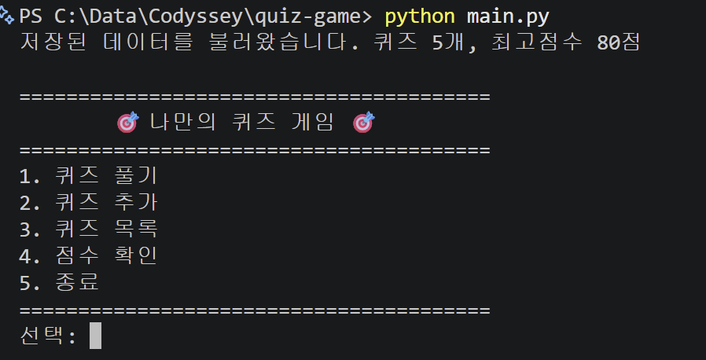
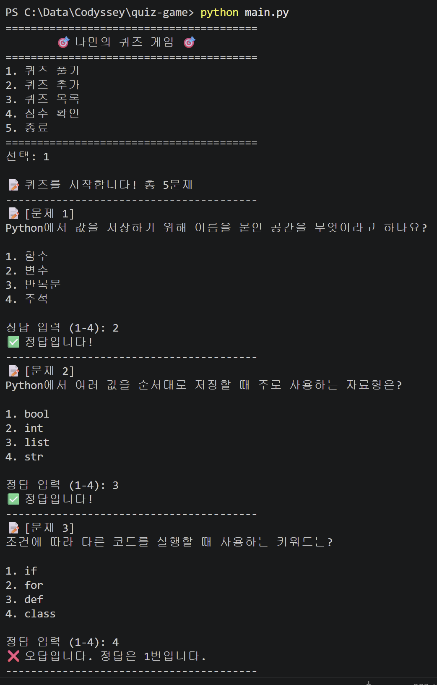
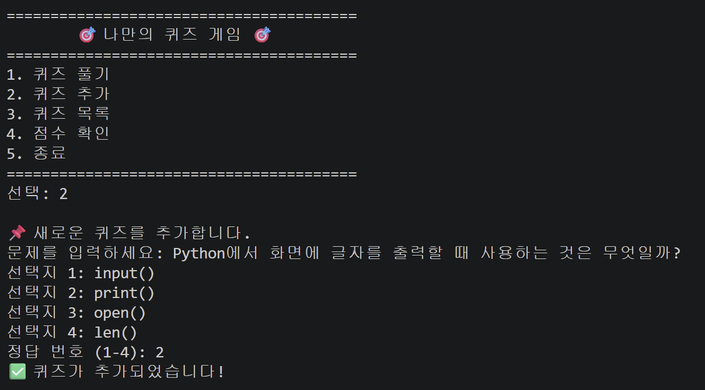
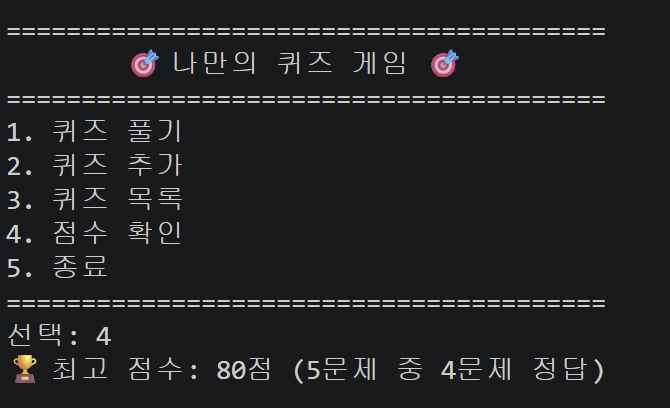
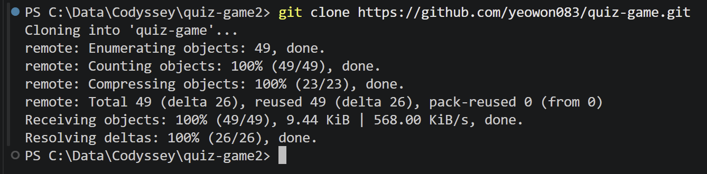
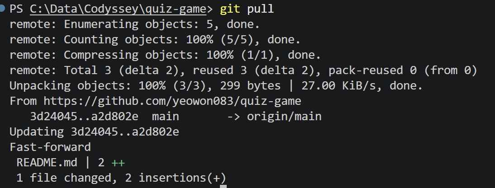

# 🎯 나만의 퀴즈 게임 — Python 기초 퀴즈

## 프로젝트 개요

터미널에서 동작하는 Python 기초 문법 주제의 퀴즈 게임입니다.
사용자는 메뉴에서 퀴즈 풀기, 퀴즈 추가, 퀴즈 목록 확인, 최고 점수 확인, 종료 기능을 선택할 수 있습니다.

퀴즈 데이터와 최고 점수는 프로젝트 루트의 `state.json` 파일에 UTF-8 인코딩으로 저장됩니다.
그래서 프로그램을 종료한 뒤 다시 실행해도 사용자가 추가한 퀴즈와 최고 점수 기록이 유지됩니다.

## 실행 환경

| 항목 | 버전 |
|------|------|
| Python | Python 3.13.2 |
| Git | git version 2.53.0.windows.2 |

## 퀴즈 주제 선정 이유

주제는 Python 기초 문법입니다.
이번 미션의 목표가 변수, 자료형, 조건문, 반복문, 함수, 클래스, 파일 입출력 같은 개념을 직접 사용해 보는 것이기 때문에, 퀴즈 주제도 Python 학습 내용과 연결했습니다.

게임을 만들면서 Python 문법을 구현하고, 게임을 실행하면서 다시 Python 개념을 복습할 수 있어 학습 흐름이 자연스럽다고 생각했습니다.
또한 Python 기초 문제는 선택지형 퀴즈로 구성하기 좋고, 이후에 Git, JSON, 객체 지향 등 다른 주제로도 쉽게 확장할 수 있습니다.

## 실행 방법

Python 3.10 이상이 설치된 환경에서 아래 명령어를 실행합니다.

```bash
python main.py
```

`state.json` 파일이 없으면 기본 퀴즈 데이터로 프로그램이 실행됩니다.
`state.json` 파일이 손상된 경우 안내 메시지를 출력하고 기본 퀴즈 데이터로 복구합니다.

## 기능 목록

| 번호 | 기능 | 설명 |
|------|------|------|
| 1 | 퀴즈 풀기 | 저장된 퀴즈를 순서대로 풀고 정답 여부와 최종 결과를 확인 |
| 2 | 퀴즈 추가 | 문제, 선택지 4개, 정답 번호를 입력해 새 퀴즈 등록 |
| 3 | 퀴즈 목록 | 저장된 퀴즈의 번호와 문제 문장 확인 |
| 4 | 점수 확인 | 최고 점수와 최고 점수 당시의 정답 수 확인 |
| 5 | 종료 | 현재 데이터를 저장하고 프로그램 종료 |

### 입력 및 예외 처리

- 숫자 입력 전후 공백 제거
- 빈 입력 처리
- 숫자 변환 실패 처리
- 허용 범위 밖 숫자 처리
- `Ctrl+C` 입력 중단 처리
- EOF 입력 스트림 종료 처리
- `state.json` 파일 없음 또는 손상 상황 처리

## 파일 구조

```text
quiz-game/
├── .gitignore
├── README.md
├── docs/
│   └── screenshots/
│       ├── add_quiz.png
│       ├── clone.png
│       ├── git log.png
│       ├── menu.png
│       ├── play.png
│       ├── pull.png
│       └── score.png
├── main.py
└── state.json
```

## 코드 구조

| 함수 | 파일 | 역할 |
|------|------|------|
| `load_state`, `save_state` | `main.py` | 퀴즈 데이터와 최고 점수를 파일에서 읽고 저장 |
| `get_number`, `get_text` | `main.py` | 사용자 입력 검증 |
| `play_quiz`, `add_quiz` | `main.py` | 퀴즈 풀이와 새 퀴즈 추가 |
| `list_quizzes`, `show_best_score` | `main.py` | 퀴즈 목록과 최고 점수 출력 |

## 데이터 파일 설명 (`state.json`)

| 항목 | 내용 |
|------|------|
| 경로 | 프로젝트 루트 `state.json` |
| 인코딩 | UTF-8 |
| 역할 | 퀴즈 목록과 최고 점수 저장 |
| 갱신 시점 | 퀴즈 추가, 최고 점수 갱신, 프로그램 종료 |

### 스키마

```json
{
    "quizzes": [
        {
            "question": "문제 내용",
            "choices": ["선택지1", "선택지2", "선택지3", "선택지4"],
            "answer": 1
        }
    ],
    "best_score": 100,
    "best_correct": 5,
    "best_total": 5
}
```

| 필드 | 타입 | 설명 |
|------|------|------|
| `quizzes` | array | 등록된 퀴즈 목록 |
| `quizzes[].question` | string | 문제 문장 |
| `quizzes[].choices` | string[4] | 선택지 4개 |
| `quizzes[].answer` | int | 정답 번호, 1부터 4까지 |
| `best_score` | int 또는 null | 최고 점수, 아직 기록이 없으면 null |
| `best_correct` | int | 최고 점수를 기록했을 때 맞힌 문제 수 |
| `best_total` | int | 최고 점수를 기록했을 때 전체 문제 수 |

## Git 실습 기록

- 기능 단위 커밋을 10개 이상 작성했습니다.
- `feature/quiz-play` 브랜치에서 퀴즈 풀이 기능을 구현한 뒤 `main` 브랜치로 병합했습니다.
- GitHub 원격 저장소에 프로젝트 코드를 push했습니다.
- GitHub 원격 저장소를 별도 디렉터리로 clone했습니다.
- clone한 저장소에서 변경사항을 commit, push한 뒤 원래 작업 디렉터리에서 pull로 가져왔습니다.

## 실행 화면 예시

### 메뉴 화면



### 퀴즈 풀기



### 퀴즈 추가



### 점수 확인



## Git 실습 화면

### 저장소 clone



### 저장소 pull



### git log


